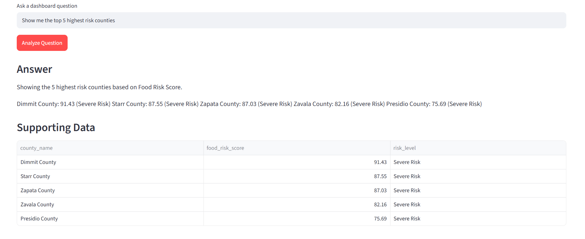

# Texas Food Insecurity Dashboard

**Live Dashboard:** [Open the Dashboard](https://texasfoodinsecuritydashboard-uuedmh47zbrxvtcvowrl4t.streamlit.app)

Built an interactive dashboard that aggregates public economic indicators into a unified Food Risk Score for all 254 Texas counties.


 ## Dashboard Preview 

 

---

## Project Highlights

- Engineered an end-to-end analytics pipeline using SQL,  MySQL, Python, and Streamlit.
- Developed a composite Food Risk Score to standardize and compare food insecurity risk across all 254 Texas counties.
- Designed a Streamlit dashboard featuring dynamic county filtering, visualizations, and drill-down analysis.
- Implemented a SQL-powered AI Analytics Assistant that uses predefined analysis functions to retrieve verified project data for natural-language questions.

# Project Overview

Food insecurity is influenced by multiple economic factors, including poverty, household income, unemployment, and participation in the Supplemental Nutrition Assistance Program (SNAP). Looking at only one of these measures makes it difficult to compare food insecurity risk across communities.

This project addresses that challenge by combining these indicators into a single Food Risk Score for every county in Texas. Publicly available county-level data from Data Commons is imported into a MySQL database, analyzed using SQL and Python, and presented through an interactive Streamlit dashboard.

The dashboard allows users to compare counties, explore county-level economic indicators, visualize Food Risk Scores, and ask supported natural-language questions through a SQL-powered AI Analytics Assistant that retrieves verified project data.

### This project explores the following areas

- Food Risk Score methodology
- County-level economic indicators
- County risk comparisons
- SQL-powered AI Analytics Assistant

### Project Resources

- Database Schema and ERD 
- SQL Data Cleaning and Preparation Scripts
- SQL Analytics Queries
- Interactive Streamlit Dashboard 

---

# Executive Summary


This analysis combines four county-level economic indicators into a composite Food Risk Score to identify and compare food insecurity risk across all 254 Texas counties. 

### Finding 1: Priority Counties

**Question**

Which counties should nonprofits prioritize for food assistance?

*To pinpoint the areas facing the highest risk of food insecurity, we created a single Food Risk Score combining poverty rates, household income, unemployment, and SNAP participation. Dimmit (91.43), Starr (87.55), Zapata (87.03), Zavala (82.16), and Presidio (75.69) counties emerged with the highest scores. These counties represent the highest-priority candidates for further assessment and resource allocation.*

### Finding 2: Potential Gaps in SNAP Participation 

**Question** 

Which counties may require additional review because poverty is high but SNAP participation is relatively low? 

*The analysis identified 10 counties that met the criteria for high poverty rates alongside low SNAP engagement: Throckmorton, Brazos, Coke, Baylor, Oldham, Coleman, Castro, Morris, Motley, and Dickens. This pattern doesn't explicitly prove a flaw in SNAP access, but it highlights a potential gap where elevated poverty isn't matching program enrollment. These locations warrant further local analysis to uncover potential barriers and optimize outreach strategies.*

### Finding 3: Statewide Risk Distribution

**Question** 

How is food insecurity risk distributed across Texas?

*The data reveals that food insecurity risk impacts all 254 Texas counties, suggesting it is a statewide issue rather than a hyper-localized one. By classifying the state into risk tiers, we identified 63 Severe Risk, 63 High Risk, 64 Moderate Risk, and 64 Low Risk counties, with a baseline average score of 41.00. This distribution supports a tiered approach to prioritizing nonprofit resources, allowing organizations to distinguish between counties requiring immediate intervention and those appropriate for longer-term planning.*


## Dashboard Features:

- Interactive KPI cards 
- County profile explorer 
- Dynamic Risk Score rankings 
- Interactive data table 
- SQL-powered AI Analytics Assistant 

## AI Analytics Assistant 

The dashboard features a SQL-powered AI Analytics Assistant that answers natural-language questions using verified project data. The assistant matches user queries to predefined analytical functions and uses Google Gemini to summarize the results while preserving the integrity of the underlying data.

### AI Assistant Preview 



### Analytics Workflow

```
Data Commons
      │
      ▼
MySQL Database
      │
      ▼
SQL & Python Analysis
      │
      ▼
Food Risk Score Calculation
      │
      ▼
Streamlit Dashboard
      │
      ▼
AI Analytics Assistant
```

# Project Structure & Data Overview

This project follows an end-to-end analytics workflow that transforms publicly available county-level economic data into an interactive dashboard for analyzing food insecurity risk across Texas. 

The database is organized into three analytical tables that separate county information, economic indicators, and calculated food risk metrics. This structure keeps the source data separate from derived metrics while supporting dashboard visualizations, KPI calculations, and analytical queries.

---

### Database Structure

The project database is organized into three analytical tables that separate county information, economic indicators, and calculated food risk metrics. This structure keeps the source data separate from derived metrics while supporting dashboard visualizations, KPI calculations, and analytical queries.


 ## Entity Relationship Diagram

 


### Database Tables

#### counties

Stores the unique identifier and name for each Texas county. This reference table links county information across the database.

#### county_metrics

Stores the county-level economic indicators used throughout the analysis, including:

- Household median income
- Poverty count
- SNAP participation
- Unemployment rate
- Population

#### county_scores

Stores the calculated metrics generated during the analytical pipeline, including:

- Poverty rate
- Food Risk Score
- Risk Quartile
- Risk Level

These metrics power the dashboard visualizations, KPI calculations, county rankings, and AI Analytics Assistant.

---

## Technology Stack 
- SQL (MySQL) 
- Python 
- Pandas 
- Streamlit 
- Google Gemini API 
- Git 
- Github 