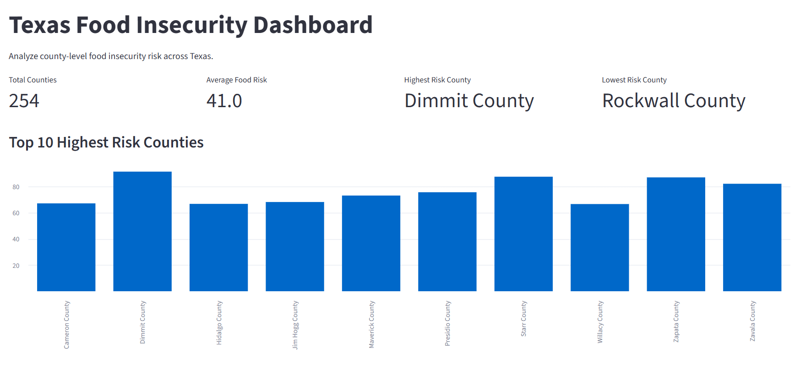
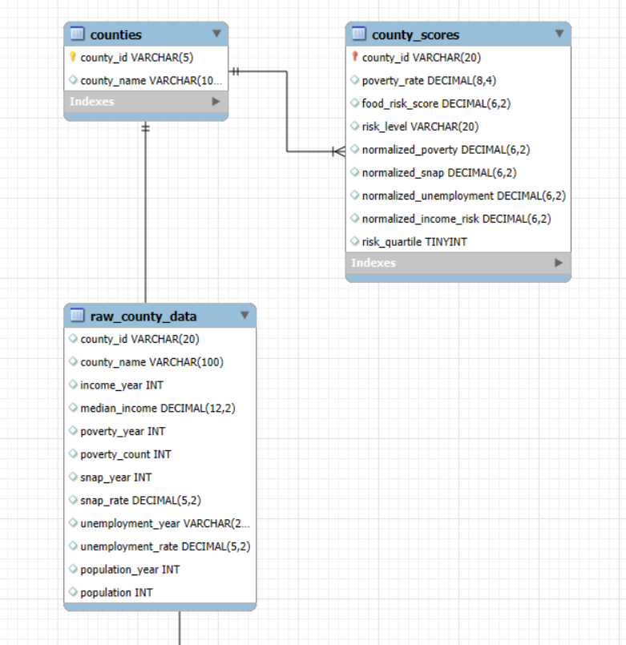

# Texas Food Insecurity Dashboard

Built an interactive dashboard that aggregates public economic indicators into a unified Food Risk Score for all 254 Texas counties.


## Live Demo 

**Try the interactive dashboard here:**

 ## Dashboard Preview 

 

---

## Project Highlights

- Engineered an end-to-end analytics pipeline using SQL,  MySQL, Python, and Streamlit.
- Developed a composite Food Risk Score to standardize and compare food insecurity risk across all 254 Texas counties.
- Designed a Streamlit dashboard featuring dynamic county filtering, visualizations, and drill-down analysis.
- Implemented a SQL-powered AI Analytics Assistant that uses predefined analysis functions to retrieve verified project data for natural-language questions.

# Project Overview

Food insecurity is influenced by multiple economic factors, including poverty, household income, unemployment, and participation in the Supplemental Nutrition Assistance Program (SNAP). Looking at only one of these measures makes it difficult to compare food insecurity risk across communities.

This project addresses that challenge by combining these indicators into a single Food Risk Score for every county in Texas. Publicly available county-level data from Data Commons is imported into a MySQL database, analyzed using SQL and Python, and presented through an interactive Streamlit dashboard.

The dashboard allows users to compare counties, explore county-level economic indicators, visualize Food Risk Scores, and ask supported natural-language questions through a SQL powered AI Analytics Assistant that retrieves verified project data.

### This project explores the following areas

- Food Risk Score methodology
- County-level economic indicators
- County risk comparisons
- SQL- powered AI Analytics Assistant

### Project Resources

- Database Schema and ERD 
- SQL Data Cleaning and Preparation Scripts *(Coming soon)*
- SQL Analytics Queries
- Interactive Streamlit Dashboard 

---

# Executive Summary


This analysis combines four county-level economic indicators into a composite Food Risk Score to identify and compare food insecurity risk across all 254 Texas counties. 

Key findings from the analysis include:

- **Finding 1** *(Replace with final insight and statistics.)*

- **Finding 2** *(Replace with final insight and statistics.)*

- **Finding 3** *(Replace with final insight and statistics.)*

The Streamlit dashboard allows users to explore these findings through interactive visualizations, county comparisons, and a SQL-powered AI Analytics Assistant that retrieves verified project data for supported natural-language questions.

## Dashboard Features:

- Interactive KPI cards 
- County profile explorer 
- Dynamic Risk Score rankings 
- Interactive data table 
- SQL-powered AI Analytics Assistant 

## AI Analytics Assistant 


### Analytics Workflow

```
Data Commons
      │
      ▼
MySQL Database
      │
      ▼
SQL & Python Analysis
      │
      ▼
Food Risk Score Calculation
      │
      ▼
Streamlit Dashboard
      │
      ▼
AI Analytics Assistant
```

# Project Structure & Data Overview

This project follows an end-to-end analytics workflow that transforms publicly available county-level economic data into an interactive dashboard for analyzing food insecurity risk across Texas. 

The database is organized into three analytical tables that separate county information, economic indicators, and calculated food risk metrics. This structure keeps the source data separate from derived metrics while supporting dashboard visualizations, KPI calculations, and analytical queries.

---

### Database Structure

The project database is organized into three analytical tables that separate county information, economic indicators, and calculated food risk metrics. This structure keeps the source data separate from derived metrics while supporting dashboard visualizations, KPI calculations, and analytical queries.


 ## Entity Relationship Diagram

 


### Database Tables

#### counties

Stores the unique identifier and name for each Texas county. This reference table links county information across the database.

#### county_metrics

Stores the county-level economic indicators used throughout the analysis, including:

- Household median income
- Poverty count
- SNAP participation
- Unemployment rate
- Population

#### county_scores

Stores the calculated metrics generated during the analytical pipeline, including:

- Poverty rate
- Food Risk Score
- Risk Quartile
- Risk Level

These metrics power the dashboard visualizations, KPI calculations, county rankings, and AI Analytics Assistant.

---

## Technology Stack 
- SQL (MySQL) 
- Python 
- Pandas 
- Streamlit 
- Google Gemini API 
- Git 
- Github 